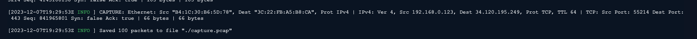
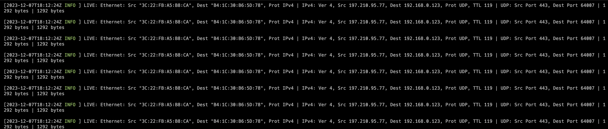

# Wyre

Wyre is a Rust-based network packet analyzer, designed for efficient and concurrent parsing of various protocols including Ethernet, IPv4, IPv6, TCP, UDP, and ICMP. It offers functionalities for both live packet capture and streaming, alongside the capability to save packet data in `.pcap` format for in-depth analysis, leveraging the [net-sift](https://github.com/0xphen/net-sift) Rust library for protocol parsing.

## Usage
### List default network interface

This command outputs the default interface
```
$ wyre interfaces default
$ <default interface>
```

### List all network interfaces
This command outputs an array of network interface names
```
$ wyre interfaces all
$ [<array of interface names>]
```
### Basic packet capture
To capture packets and save them to a file, use the capture command with the following arguments:

- `dir_name (-d)`: The directory to save the .pcap file in.
- `filename (-f)`: The name of the file to save the captured packets.
- `interface (-i)`: The name of the network interface to capture the packets from.
- `size (-s)`: The number of packets to capture.

#### Example:
Capturing 100 packets from the eth0 interface and save them to a capture.pcap in the current working directory:

```
$ wyre capture -d ./ -f capture -i eth0 -s 1000
```



This will initiate packet capture on the eth0 interface, save the first 100 packets to a file named capture.pcap, and then terminate.

### Live Packet Streaming
To stream live packet data directly to the terminal, use the stream command with the network interface name as the argument.

- `interface (-i)`: The name of the network interface to capture the packets from.

#### Example:
Live stream packets on the eth0 interface:
```
$ wyre stream -i eth0
```



This command will stream the packet data flowing through the eth0 interface to your terminal in real-time.

## Supported Protocols
- [X] ethernet
- [X] ipv4
- [X] ipv6
- [X] tcp
- [X] udp
- [X] icmp

## Planned Enhancements
- [] Selective Packet Capture

